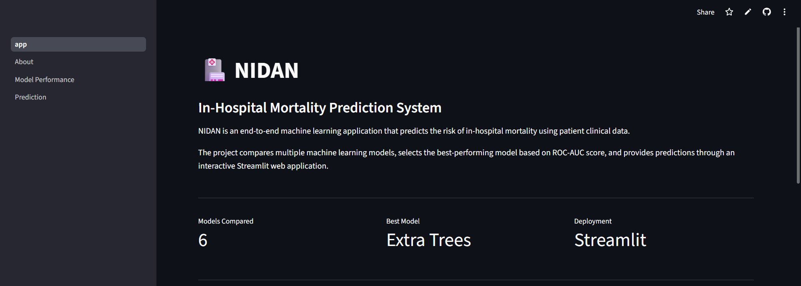
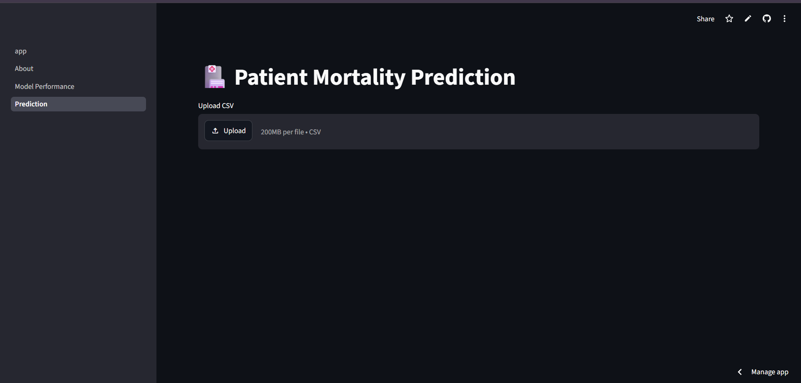
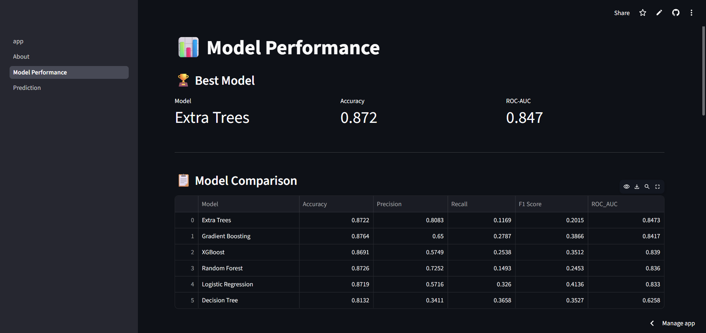
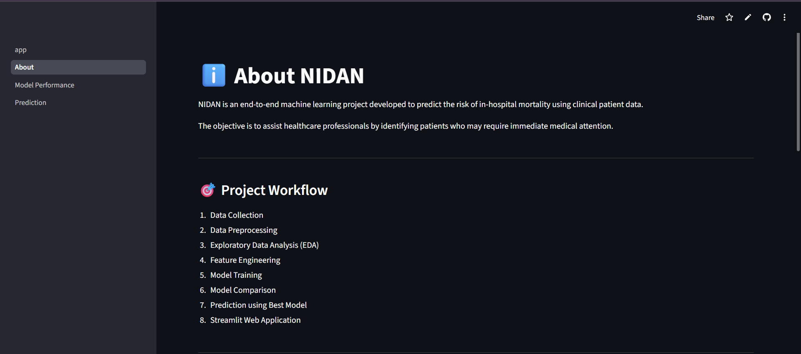

[](https://fgtb7i5ssbbzidviiqhmy8.streamlit.app/)

# NIDAN

## In-Hospital Mortality Prediction using Machine Learning

NIDAN is an end-to-end machine learning application that predicts the risk of in-hospital mortality using patient clinical data. The project follows a complete machine learning workflow, including data preprocessing, feature engineering, model training, evaluation, and deployment through an interactive Streamlit web application.

---

## Live Demo

**Streamlit Application**

https://fgtb7i5ssbbzidviiqhmy8.streamlit.app/

---

## Project Overview

The objective of this project is to predict the probability of in-hospital mortality using patient clinical information. Multiple machine learning algorithms were trained, evaluated, and compared to identify the best-performing model. The selected model was then deployed using Streamlit, providing a simple and interactive interface for making predictions.

---

## Features

- Exploratory Data Analysis (EDA)
- Data Preprocessing
- Feature Engineering
- Multiple Machine Learning Models
- Model Performance Comparison
- Automatic Best Model Selection
- In-Hospital Mortality Prediction
- Interactive Streamlit Web Application
- Download Prediction Results

---

## Application Preview

### Home Page



---

### Prediction Page



---

### Model Performance



---

### About



---

## Machine Learning Models

The following classification algorithms were trained and evaluated:

- Logistic Regression
- Decision Tree
- Random Forest
- Extra Trees Classifier
- Gradient Boosting
- XGBoost

The final deployed model was selected based on the highest ROC-AUC score.

---

## Technologies Used

- Python
- Pandas
- NumPy
- Scikit-learn
- XGBoost
- Matplotlib
- Joblib
- Streamlit
- Git
- GitHub

---

## Project Structure

```text
NIDAN/
│
├── app/
│   ├── app.py
│   └── pages/
│       ├── Prediction.py
│       ├── Model_Performance.py
│       └── About.py
│
├── data/
├── images/
│   ├── home.png
│   ├── prediction.png
│   ├── performance.png
│   └── about.png
│
├── models/
│   ├── best_model.pkl
│   └── logistic_regression.pkl
│
├── reports/
│
├── src/
│
├── README.md
├── requirements.txt
├── .gitignore
└── LICENSE
```

---

## Installation

Clone the repository.

```bash
git clone https://github.com/seerat-gh/NIDAN.git
```

Navigate to the project directory.

```bash
cd NIDAN
```

Create a virtual environment.

```bash
python -m venv .venv
```

Activate the virtual environment.

### Windows

```bash
.venv\Scripts\activate
```

### Linux / macOS

```bash
source .venv/bin/activate
```

Install the required dependencies.

```bash
pip install -r requirements.txt
```

---

## Running the Application

Launch the Streamlit application.

```bash
streamlit run app/app.py
```

---

## Workflow

1. Load the clinical dataset.
2. Perform exploratory data analysis.
3. Clean and preprocess the data.
4. Engineer relevant features.
5. Train multiple machine learning models.
6. Evaluate and compare model performance.
7. Select the best-performing model.
8. Predict in-hospital mortality.
9. Deploy the application using Streamlit.

---

## Results

The application enables users to:

- Upload patient datasets
- Predict in-hospital mortality
- Compare model performance
- View prediction summaries
- Download prediction results

---

## Future Improvements

- Hyperparameter optimization
- Explainable AI using SHAP and LIME
- Deep learning-based prediction models
- REST API integration
- Docker support
- Cloud deployment
- Real-time hospital dashboard
- Integration with Electronic Health Record (EHR) systems

---

## Author

**Seerat**

---

## License

This project is licensed under the MIT License. See the `LICENSE` file for more information.